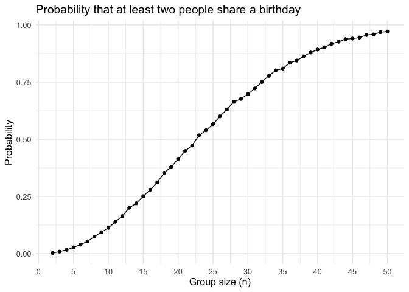
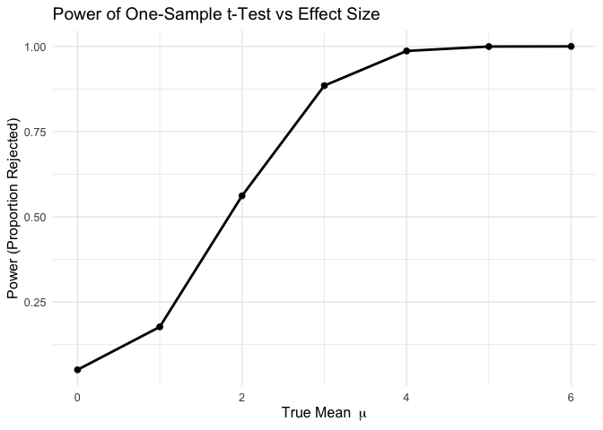
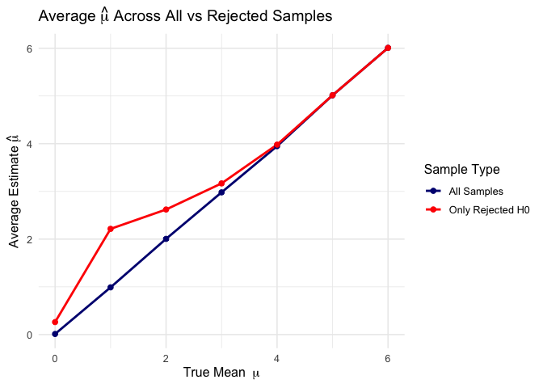
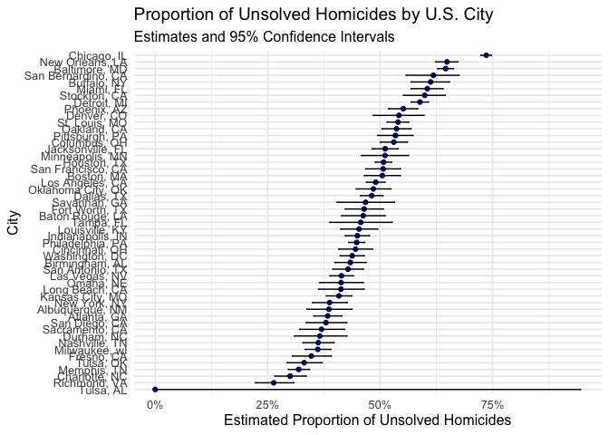

p8105_hw5_zn2220
================
Ziang Niu
2025-10-31

# Problem 1

## Write a function that, for a fixed group size, randomly draws “birthdays” for each person; checks whether there are duplicate birthdays in the group; and returns TRUE or FALSE based on the result.

Write the function.

``` r
duplicate_birthday <- function(n) {
birthdays <- sample(1:365, size = n, replace = TRUE)
any(duplicated(birthdays))
}
```

Check returns.

``` r
duplicate_birthday(2)
```

    ## [1] FALSE

``` r
duplicate_birthday(23)
```

    ## [1] TRUE

``` r
duplicate_birthday(50)
```

    ## [1] TRUE

## Next, run this function 10000 times for each group size between 2 and 50. For each group size, compute the probability that at least two people in the group will share a birthday by averaging across the 10000 simulation runs. Make a plot showing the probability as a function of group size, and comment on your results.

Create a tibble.

``` r
n <- 2:50
repeats <- 10000

prob <- numeric(length(n))

for (i in seq_along(n)) {
  group_size <- n[i]
  prob[i] <- mean(replicate(repeats, duplicate_birthday(group_size)))
}

prob_list <- tibble(n = n, probability = prob)
```

draw a plot.

``` r
ggplot(prob_list, aes(x = n, y = prob)) +
geom_line() +
geom_point() +
scale_x_continuous(breaks = seq(0, 50, by = 5)) +
labs(title = "Probability that at least two people share a birthday",
x = "Group size (n)",
y = "Probability") +
theme_minimal(base_size = 12)
```

<!-- -->

This plot shows the simulated probability that at least two people in a
group share a birthday. The probability rises sharply as the group size
(n) increases. As the plot shows, the probability crosses the 50%
threshold at a group size of n = 23. By the time the group size reaches
50, our simulation shows the probability of a shared birthday is
approximately 97%.

# Problem 2

### Set up

``` r
run_t_sim <- function(mu, n = 30, sigma = 5, repeats = 5000, alpha = 0.05) {
  tibble(rep = 1:repeats) %>%
    mutate(
      data = map(rep, ~ rnorm(n, mean = mu, sd = sigma)),
      test = map(data, ~ broom::tidy(t.test(.x, mu = 0))),
      mu_hat = map_dbl(test, "estimate"),
      p_value = map_dbl(test, "p.value"),
      reject = p_value < alpha
    )
}

mus <- 0:6

results_p2 <- data.frame(
  mu = numeric(),
  power = numeric(),
  mean_mu_hat_all = numeric(),
  mean_mu_hat_reject = numeric()
)

for (m in mus) {
  df <- run_t_sim(mu = m)
  
  power <- mean(df$reject)
  mean_mu_hat_all <- mean(df$mu_hat)
  mean_mu_hat_reject <- if (any(df$reject)) mean(df$mu_hat[df$reject]) else NA
  
  results_p2 <- rbind(
    results_p2,
    data.frame(
      mu = m,
      power = power,
      mean_mu_hat_all = mean_mu_hat_all,
      mean_mu_hat_reject = mean_mu_hat_reject
    )
  )
}

results_p2
```

    ##   mu  power mean_mu_hat_all mean_mu_hat_reject
    ## 1  0 0.0508      0.01202228          0.2610999
    ## 2  1 0.1768      0.98912226          2.2145598
    ## 3  2 0.5616      2.00497043          2.6202271
    ## 4  3 0.8848      2.97969836          3.1676493
    ## 5  4 0.9866      3.94773976          3.9797459
    ## 6  5 0.9996      5.01382503          5.0150632
    ## 7  6 1.0000      6.00749753          6.0074975

### Plot 1

``` r
ggplot(results_p2, aes(x = mu, y = power)) +
  geom_line(size = 1) + 
  geom_point(size = 2) +
  labs(
    title = "Power of One-Sample t-Test vs Effect Size",
    x = expression("True Mean " ~ mu),
    y = "Power (Proportion Rejected)"
  ) +
  theme_minimal(base_size = 12)
```

    ## Warning: Using `size` aesthetic for lines was deprecated in ggplot2 3.4.0.
    ## ℹ Please use `linewidth` instead.
    ## This warning is displayed once every 8 hours.
    ## Call `lifecycle::last_lifecycle_warnings()` to see where this warning was
    ## generated.

<!-- -->

This plot illustrates the relationship between the true effect size (the
true mean, $\mu$) and the statistical power of the t-test. When the null
hypothesis is true ($\mu=0$), the power is approximately 5%, which
correctly matches our $\alpha$-level (the Type I error rate). As the
effect size $\mu$ increases, the power grows non-linearly, surpassing
80% power at around $\mu=3$ and approaching 100% for effect sizes of 4
or more.

### Plot 2

``` r
results_p2_long <- results_p2 %>%
  pivot_longer(
    cols = c(mean_mu_hat_all, mean_mu_hat_reject),
    names_to = "sample_type",
    values_to = "mean_mu_hat"
  )

ggplot(results_p2_long, aes(x = mu, y = mean_mu_hat, color = sample_type)) +
  geom_line(size = 1) + 
  geom_point(size = 2) +
  labs(
    title = expression("Average " * hat(mu) * " Across All vs Rejected Samples"),
    x = expression("True Mean " ~ mu),
    y = expression("Average Estimate " * hat(mu)),
    color = "Sample Type"
  ) +
  scale_color_manual(
    labels = c("All Samples", "Only Rejected H0"),
    values = c("navy", "red")
  ) +
  theme_minimal(base_size = 12)
```

<!-- -->

This plot compares the average estimated $\hat{\mu}$ from all samples
(blue line) versus the average $\hat{\mu}$ from only samples where the
null hypothesis was rejected (red line).

- The blue line (all samples) falls almost perfectly on the y=x line,
  demonstrating that the sample mean $\hat{\mu}$ is an unbiased
  estimator of the true $\mu$.

- The red line (rejected samples) shows a significant upward bias when
  power is low (i.e., for small true values of $\mu$). This is a classic
  example of selection bias, or the “winner’s curse.” When the true
  effect is small, only the simulations that, by random chance, produce
  an unusually large $\hat{\mu}$ will be “significant” (p \< 0.05). By
  averaging only these “winners,” we get an inflated estimate. As the
  true $\mu$ increases, power approaches 100%, meaning nearly all tests
  are significant. At that point, the selection bias disappears, and the
  red line converges with the blue line.

# Problem 3

## Describe the raw data. Create a city_state variable (e.g. “Baltimore, MD”) and then summarize within cities to obtain the total number of homicides and the number of unsolved homicides (those for which the disposition is “Closed without arrest” or “Open/No arrest”).

``` r
data_url <- "https://raw.githubusercontent.com/washingtonpost/data-homicides/master/homicide-data.csv"
homicides_raw <- read_csv(data_url)
```

    ## Rows: 52179 Columns: 12
    ## ── Column specification ────────────────────────────────────────────────────────
    ## Delimiter: ","
    ## chr (9): uid, victim_last, victim_first, victim_race, victim_age, victim_sex...
    ## dbl (3): reported_date, lat, lon
    ## 
    ## ℹ Use `spec()` to retrieve the full column specification for this data.
    ## ℹ Specify the column types or set `show_col_types = FALSE` to quiet this message.

``` r
summary(homicides_raw)
```

    ##      uid            reported_date       victim_last        victim_first      
    ##  Length:52179       Min.   : 20070101   Length:52179       Length:52179      
    ##  Class :character   1st Qu.: 20100318   Class :character   Class :character  
    ##  Mode  :character   Median : 20121216   Mode  :character   Mode  :character  
    ##                     Mean   : 20130899                                        
    ##                     3rd Qu.: 20150911                                        
    ##                     Max.   :201511105                                        
    ##                                                                              
    ##  victim_race         victim_age         victim_sex            city          
    ##  Length:52179       Length:52179       Length:52179       Length:52179      
    ##  Class :character   Class :character   Class :character   Class :character  
    ##  Mode  :character   Mode  :character   Mode  :character   Mode  :character  
    ##                                                                             
    ##                                                                             
    ##                                                                             
    ##                                                                             
    ##     state                lat             lon          disposition       
    ##  Length:52179       Min.   :25.73   Min.   :-122.51   Length:52179      
    ##  Class :character   1st Qu.:33.77   1st Qu.: -96.00   Class :character  
    ##  Mode  :character   Median :38.52   Median : -87.71   Mode  :character  
    ##                     Mean   :37.03   Mean   : -91.47                     
    ##                     3rd Qu.:40.03   3rd Qu.: -81.76                     
    ##                     Max.   :45.05   Max.   : -71.01                     
    ##                     NA's   :60      NA's   :60

``` r
city_summary <- homicides_raw %>%
  mutate(city_state = str_c(city, state, sep = ", ")) %>%
  group_by(city_state) %>%
  summarize(
    total_homicides = n(),
    unsolved_homicides = sum(disposition %in% c("Closed without arrest", "Open/No arrest"))
  ) %>%
  ungroup()
```

The raw data contains 52,179 observations, representing individual
homicide reports. The summary() output shows key variables: uid (a
unique ID), reported_date, victim demographics (race, age, sex),
location (city, state), and disposition. The disposition variable is
critical, as it tells us whether a case was “Closed without arrest” or
“Open/No arrest,” which we will use to define “unsolved.”

## For the city of Baltimore, MD, use the prop.test function to estimate the proportion of homicides that are unsolved; save the output of prop.test as an R object, apply the broom::tidy to this object and pull the estimated proportion and confidence intervals from the resulting tidy dataframe.

``` r
baltimore_data <- city_summary %>%
  filter(city_state == "Baltimore, MD")

baltimore_prop_test <- prop.test(
  x = baltimore_data$unsolved_homicides,
  n = baltimore_data$total_homicides
)

baltimore_tidy <- broom::tidy(baltimore_prop_test)

baltimore_tidy
```

    ## # A tibble: 1 × 8
    ##   estimate statistic  p.value parameter conf.low conf.high method    alternative
    ##      <dbl>     <dbl>    <dbl>     <int>    <dbl>     <dbl> <chr>     <chr>      
    ## 1    0.646      239. 6.46e-54         1    0.628     0.663 1-sample… two.sided

For the city of Baltimore, MD, the prop.test function estimates the
proportion of unsolved homicides to be 64.6%. The 95% confidence
interval for this estimate is \[62.8%, 66.3%\], suggesting we are highly
confident that the true proportion lies within this range.

## Now run prop.test for each of the cities in your dataset, and extract both the proportion of unsolved homicides and the confidence interval for each. Do this within a “tidy” pipeline, making use of purrr::map, purrr::map2, list columns and unnest as necessary to create a tidy dataframe with estimated proportions and CIs for each city.

``` r
city_proportions_tidy <- city_summary %>%
  mutate(
    prop_test_obj = map2(unsolved_homicides, total_homicides, 
                         ~ prop.test(x = .x, n = .y))
  ) %>%
  mutate(
    tidy_results = map(prop_test_obj, broom::tidy)
  ) %>%
  unnest(tidy_results) %>%
  select(
    city_state, 
    total_homicides, 
    unsolved_homicides, 
    estimate, 
    conf.low, 
    conf.high
  )
```

    ## Warning: There was 1 warning in `mutate()`.
    ## ℹ In argument: `prop_test_obj = map2(...)`.
    ## Caused by warning in `prop.test()`:
    ## ! Chi-squared approximation may be incorrect

``` r
summary(city_proportions_tidy)
```

    ##   city_state        total_homicides  unsolved_homicides    estimate     
    ##  Length:51          Min.   :   1.0   Min.   :   0.0     Min.   :0.0000  
    ##  Class :character   1st Qu.: 436.5   1st Qu.: 181.0     1st Qu.:0.3869  
    ##  Mode  :character   Median : 687.0   Median : 326.0     Median :0.4567  
    ##                     Mean   :1023.1   Mean   : 519.7     Mean   :0.4595  
    ##                     3rd Qu.:1256.0   3rd Qu.: 573.5     3rd Qu.:0.5323  
    ##                     Max.   :5535.0   Max.   :4073.0     Max.   :0.7359  
    ##     conf.low        conf.high     
    ##  Min.   :0.0000   Min.   :0.3083  
    ##  1st Qu.:0.3511   1st Qu.:0.4373  
    ##  Median :0.4142   Median :0.5072  
    ##  Mean   :0.4234   Mean   :0.5147  
    ##  3rd Qu.:0.4918   3rd Qu.:0.5661  
    ##  Max.   :0.7240   Max.   :0.9454

## Create a plot that shows the estimates and CIs for each city – check out geom_errorbar for a way to add error bars based on the upper and lower limits. Organize cities according to the proportion of unsolved homicides.

``` r
ggplot(city_proportions_tidy, 
       aes(x = reorder(city_state, estimate), y = estimate)) +
  geom_point(color = "darkblue") +
  geom_errorbar(aes(ymin = conf.low, ymax = conf.high), width = 0.2) +
  coord_flip() +
  labs(
    title = "Proportion of Unsolved Homicides by U.S. City",
    subtitle = "Estimates and 95% Confidence Intervals",
    x = "City",
    y = "Estimated Proportion of Unsolved Homicides"
  ) +
  theme_minimal(base_size = 12) +
  scale_y_continuous(labels = scales::percent_format())
```

<!-- -->

This plot displays the estimated proportion of unsolved homicides and
their 95% confidence intervals for all 50 cities, sorted from the lowest
proportion to the highest.

There is dramatic variation across cities. Some cities, like Richmond,
VA, have unsolved rates below 30%, while others, like Chicago, IL, have
rates exceeding 70%. The error bars represent our uncertainty in these
estimates. Cities with fewer total homicides (and thus smaller sample
sizes) tend to have wider confidence intervals, indicating more
uncertainty about the true proportion. Conversely, cities with many
cases, like Baltimore, MD, have very narrow confidence intervals.
